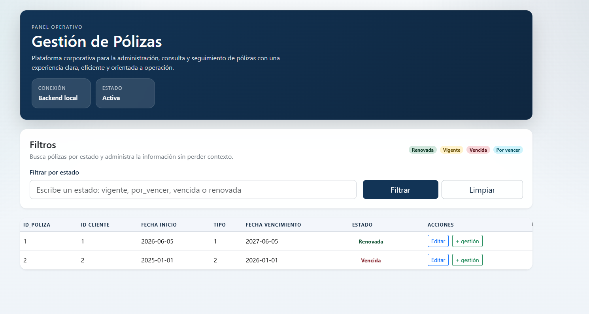
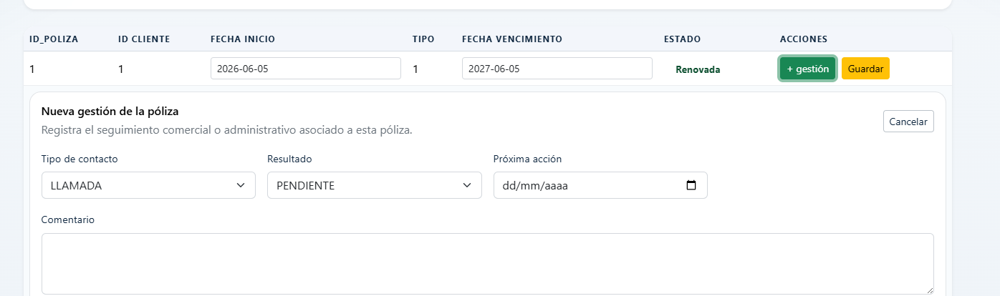

  # análisis del problema, supuestos y decisiones

  link Video: https://www.loom.com/share/32ca5ea543dd4516a967a034c00e9b76

## problema
El mes pasado, María, una asesora con 280 clientes activos, nos contó: 
"Yo tengo todo en un Excel gigante. Cada lunes filtro las pólizas que vencen ese 
mes, llamo cliente por cliente, marco una columna 'gestionado' con una X, y 
cuando renuevan pongo la nueva fecha. Lo malo es que el Excel se daña, se 
duplica, se pierde el contexto de qué le ofrecí a quién. Y cuando una póliza vence 
sin que yo me dé cuenta, pierdo el cliente porque se va con otro asesor. Eso me 
pasa con 5-10 clientes al mes." 
María necesita reemplazar su Excel con algo mejor.

## análisis del problema

1. excel se daña, se duplica: falta de integridad / estabilidad del dato
2. se pierde el contexto de que le ofreci a quien: NO hay historial de gestiones.
3. se pierde el control de que pólizas vencen: NO hay recordatorio o renovacion automática.
4. perdidad de clientes: impacto directo en ingresos.

En resumen: el problema es un proceso manual sobre una herrramienta inadecuada que genera fuga de clientes por falta de alertas y trazabilidad.

 # decisiones

 Para este caso, elegi crear una base de datos relacional sencilla pero bien estructurada, ya que puede resolver varios problemas de María:

Control de clientes
Control de pólizas
Seguimiento de renovaciones
Historial de gestión comercial
Evitar pérdida de información
Reemplazar el Excel manual

La idea es mantener un modelo simple, escalable y fácil de implementar en SQLite.
Modelo Relacional Propuesto
Entidades principales

asesores
Usuarios del sistema (como María)
Permite que la plataforma sea multiusuario SaaS.

clientes
Personas aseguradas

tipos_poliza
Auto, hogar, vida, etc.

polizas
Contratos vigentes del cliente

gestiones
Seguimiento comercial realizado por el asesor.
Esto evita pérdida de contexto.

Diagrama Relacional
+------------------+
|    asesores      |
+------------------+
| id_asesor PK     |
| nombre           |
| email            |
| telefono         |
+------------------+
          |
          | 1:N
          |
+------------------+
|    clientes      |
+------------------+
| id_cliente PK    |
| id_asesor FK     |
| nombre           |
| documento        |
| telefono         |
| email            |
| direccion        |
| fecha_registro   |
+------------------+
          |
          | 1:N
          |
+----------------------+                  +--------------------------+
|      polizas         |                  |  VIEW poliza_con_estado  |                  |
+----------------------+                  +--------------------------+
| id_poliza PK         |                  |      id_poliza           |
| id_cliente FK        |                  |      id_cliente          |
| id_tipo_poliza FK    |                  |      id_tipo_poliza      |
| numero_poliza        |---------|               fecha_inicio        |
| aseguradora          |                  |      fecha_vencimiento   |
| fecha_inicio         |                  |      CASE                |
|                      |                  |      END AS estado       |
|                      |                  |        FROM poliza       |
| fecha_vencimiento    |                  |                          |
+----------------------+                   +--------------------------+
          |
          | N:1
          |
+----------------------+
|   tipos_poliza       |
+----------------------+
| id_tipo_poliza PK    |
| nombre               |
+----------------------+

          |
          | 1:N
          |
+----------------------+
|      gestiones       |
+----------------------+
| id_gestion PK        |
| id_poliza FK         |
| fecha_gestion        |
| tipo_contacto        |
| comentario           |
| resultado            |
| proxima_accion       |
+----------------------+





1. Interfaz principal: permite filtar las polizas segun su estado (vigente, vencida, por vencer, renovada)
2. permite modificar la fecha de vencimiento de las polizas,cambiando automaticamente su estado.Esto lo hace a traves de una vista que calcula el estado de la poliza. la he diseñado para que pueda ponerla en estado por_vencer 30 dias antes de la fecha de vencimiento.
3. permite agregar nuevas gestiones a las polizas, permitiendo el control de las acciones realizadas.


## futuras mejoras
* roles y permisos de usuario
* enviar notificaciones a correo electronico de polizas por vencer.
* ampliar el CRUD de polizas 
* dashboard con estadisticas de polizas por estado


## Endpoints
 GET: /polizas   Muestra todas las polizas

 GET: /polizas?estado=vencida   filtra las polizas por estado

 GET: /polizas?id_cliente=1   filtra las polizas por cliente

 GET: /polizas?id_poliza=2   filtra una poliza especifica
 
 PUT: /polizas/1   actualiza la fecha de vencimiento y fecha de inicio de la poliza con id 1

 ejemplo: {"fecha_vencimiento": "2025-12-31", "fecha_inicio": "2025-01-01"}

 GET: /clientes   Muestra todos los clientes
 
 POST: /gestiones   agrega una nueva gestion a la poliza con id proporcionado en el body

ejemplo:
```
Body:
 {
  id_poliza: '1',
  tipo_contacto: 'EMAIL',
  resultado: 'RENOVADO',
  comentario: 'llamar nuevamente',
  proxima_accion: '2026-06-22',
  fecha_gestion: '2026-06-22'
}

